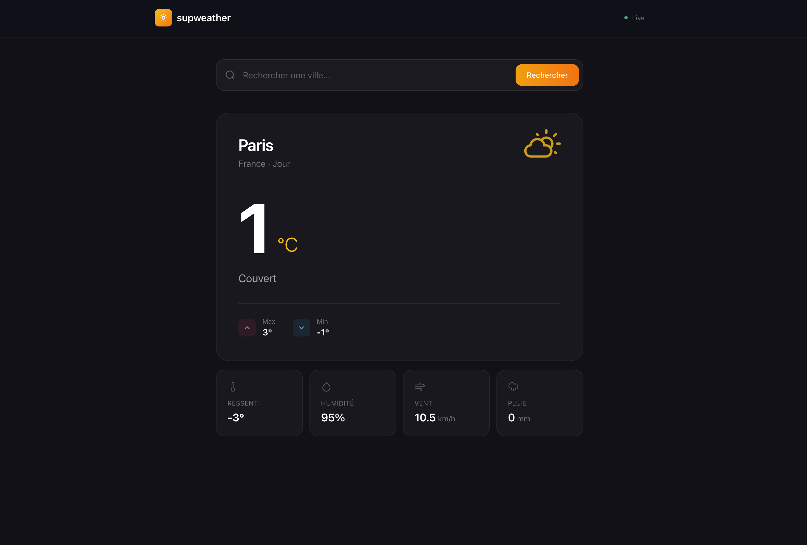
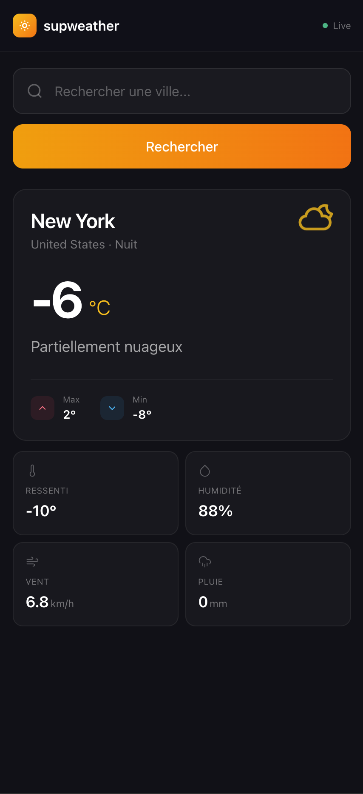

# ☀️ SupWeather

Application météo moderne et minimaliste avec design élégant. Recherchez la météo de n'importe quelle ville dans le monde et obtenez des informations en temps réel.


---

## ✨ Fonctionnalités

- 🌡️ **Météo en temps réel** - Température actuelle, ressenti thermique, min/max du jour
- 🔍 **Recherche intelligente** - Recherchez n'importe quelle ville dans le monde
- 📊 **Métriques détaillées** - Humidité, vitesse du vent, précipitations
- 🎨 **Design épuré** - Interface minimaliste avec accent ambre/doré chaleureux
- 📱 **Totalement responsive** - Expérience optimisée mobile, tablette et desktop
- ⚡ **Performance** - Animations fluides et chargement instantané

---

## 📸 Aperçu

### Interface Desktop


*Affichage des informations météo complètes*

### Interface Mobile

<p align="center">
  
</p>

*Interface responsive optimisée pour mobile*

---

## 🛠️ Stack Technique

### Frontend
- **React 18** - Library UI avec Hooks
- **Redux** + **Redux Thunk** - Gestion d'état globale
- **React Router** - Navigation
- **Tailwind CSS v4** - Framework CSS moderne
- **DaisyUI** - Composants UI
- **Vite** - Build tool ultra-rapide
- **Weather Icons** - Bibliothèque d'icônes météo

### Backend
- **Node.js** - Runtime JavaScript
- **Express** - Framework web minimaliste
- **Axios** - Client HTTP
- **Open-Meteo API** - API météo gratuite et open-source

### Outils de développement
- **Nodemon** - Auto-reload du serveur
- **Concurrently** - Exécution parallèle front + back

---

## 🚀 Installation & Lancement

### Prérequis
- Node.js 18+ et npm installés
- Un éditeur de code (VS Code recommandé)

### Étapes d'installation

1. **Cloner le repository**
```bash
git clone https://github.com/soul-diallo/supweather.git
cd supweather
```

2. **Installer les dépendances**
```bash
# Dépendances du backend
npm install

# Dépendances du frontend
npm run client-install
```

3. **Configuration**

Créez le fichier `config/keys.js` :
```javascript
module.exports = {
  weatherApiKey: 'VOTRE_CLE_API', // Optionnel pour Open-Meteo
  port: process.env.PORT || 5001
};
```

4. **Lancer l'application**

**Option 1 : Tout en une commande (recommandé)**
```bash
npm run dev
```
Cette commande lance automatiquement :
- Le serveur backend sur `http://localhost:5001`
- Le serveur frontend sur `http://localhost:5173`

**Option 2 : Séparément**

Terminal 1 - Backend :
```bash
npm run server
```

Terminal 2 - Frontend :
```bash
npm run client
```

5. **Accéder à l'application**

Ouvrez votre navigateur sur :
```
http://localhost:5173
```

---

## 📦 Structure du Projet

```
supweather/
│
├── client/                    # Application React (Frontend)
│   ├── src/
│   │   ├── actions/          # Redux actions
│   │   │   └── weatherActions.js
│   │   ├── components/
│   │   │   ├── layout/       # Composants de mise en page
│   │   │   │   ├── Navbar.jsx
│   │   │   │   └── Landing.jsx
│   │   │   └── weather/      # Composants météo
│   │   │       └── WeatherDisplay.jsx
│   │   ├── reducers/         # Redux reducers
│   │   │   ├── index.js
│   │   │   └── weatherReducer.js
│   │   ├── utils/            # Utilitaires
│   │   │   └── weatherTheme.js
│   │   ├── App.jsx           # Composant racine
│   │   ├── index.css         # Styles globaux + Tailwind
│   │   ├── main.jsx          # Point d'entrée
│   │   └── store.js          # Configuration Redux
│   ├── public/               # Assets statiques
│   ├── package.json
│   └── vite.config.js        # Configuration Vite
│
├── routes/
│   └── api/
│       └── weather.js        # Routes API météo
│
├── config/
│   └── keys.js              # Configuration (non versionné)
│
├── screenshots/             # Captures d'écran
│
├── server.js                # Serveur Express
├── package.json             # Dépendances backend
└── README.md
```

---

## 🎨 Design System

### Palette de Couleurs
```css
Background principal : #111118  /* Bleu-noir profond */
Background cards     : #18181f  /* Légèrement plus clair */
Accent principal     : #e4a853  /* Ambre chaleureux */
Texte principal      : #f4f4f5  /* Blanc cassé */
Texte secondaire     : rgba(244, 244, 245, 0.6)
Texte tertiaire      : rgba(244, 244, 245, 0.4)
```

### Typographie
- **Famille de police** : Satoshi
- **Poids utilisés** : 
  - 400 (Regular) - Texte courant
  - 600 (Semibold) - Labels et sous-titres
  - 700 (Bold) - Titres et température

### Composants Clés
- **Cards** : Fond semi-transparent avec bordures subtiles
- **Input** : Focus avec glow ambre
- **Boutons** : Gradient ambre-orange avec effet hover
- **Animations** : Fade-in, float (icône météo)

---

## 🔑 Variables d'Environnement

### Backend
Fichier `config/keys.js` :
```javascript
module.exports = {
  weatherApiKey: 'YOUR_API_KEY',  // Optionnel pour Open-Meteo
  port: 5001
};
```

### Frontend
L'URL de l'API est configurée dans les actions Redux.
Pour la production, modifiez `client/src/actions/weatherActions.js`.

---

## 📝 Scripts Disponibles

### Backend (racine)
```bash
npm start           # Lance le serveur en production
npm run server      # Lance le serveur en mode dev (avec nodemon)
npm run client      # Lance uniquement le frontend
npm run dev         # Lance backend + frontend simultanément
npm run client-install  # Installe les dépendances du frontend
```

### Frontend (dossier client/)
```bash
npm run dev         # Lance le serveur de développement Vite
npm run build       # Build de production
npm run preview     # Prévisualise le build de production
```

---

## 🌟 Fonctionnalités Détaillées

### Recherche de Ville
- Recherche instantanée par nom de ville
- Suggestions de villes populaires (Paris, Tokyo, New York, Londres, Sydney)
- Gestion des erreurs avec messages clairs

### Affichage Météo
- **Carte principale** : Température actuelle avec grande typographie, icône météo animée
- **Min/Max** : Températures minimale et maximale du jour avec indicateurs visuels
- **Métriques** : 4 cartes pour ressenti, humidité, vent et précipitations

### Responsive Design
- **Mobile** : Layout vertical optimisé, bouton de recherche pleine largeur
- **Tablette** : Grille 2x2 pour les métriques
- **Desktop** : Grille 4 colonnes, bouton intégré dans l'input

---

## 🎯 Choix Techniques

### Pourquoi cette stack ?

- **React + Redux** : Architecture scalable avec state management robuste
- **Tailwind CSS v4** : Styling rapide et maintenable, custom theme
- **Vite** : Build ultra-rapide, HMR instantané
- **Express** : API simple et performante
- **Open-Meteo** : API gratuite sans clé requise, données fiables

### Optimisations

- Composants React optimisés avec PropTypes
- CSS minimaliste sans surcharge
- Animations avec `prefers-reduced-motion`
- Architecture modulaire et réutilisable

---

## 🐛 Résolution de Problèmes

### Le serveur ne démarre pas
```bash
# Vérifiez que le port 5001 n'est pas utilisé
lsof -ti:5001 | xargs kill -9

# Relancez
npm run dev
```

### Les icônes météo ne s'affichent pas
```bash
# Réinstallez les dépendances du frontend
cd client
rm -rf node_modules package-lock.json
npm install
```

### Erreur CORS
Vérifiez que le proxy est bien configuré dans `client/package.json` :
```json
"proxy": "http://localhost:5001"
```

---

## 📚 Ressources & Crédits

- [Open-Meteo API](https://open-meteo.com/) - Données météo gratuites
- [Weather Icons](https://github.com/erikflowers/weather-icons) - Icônes météo open-source
- [Tailwind CSS](https://tailwindcss.com/) - Framework CSS
- [Satoshi Font](https://www.fontshare.com/fonts/satoshi) - Typographie moderne

---

## 📄 Licence

Ce projet est un projet personnel réalisé dans le cadre d'un portfolio.  
Libre d'utilisation pour référence ou apprentissage.

---

## 👤 Auteur

**Souleymane Diallo**

🔗 [GitHub](https://github.com/soul-diallo) 

---

<p align="center">
  Développé avec ❤️ et React
</p>
